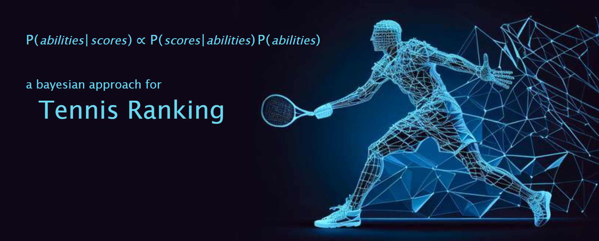

# Bayesian Tennis Ranking



Let's consider a database of tennis matches as shown below:

|      | players A                           | players B                             | score     | tournament                  |
|------|------------------------------------|---------------------------------------|-----------|-----------------------------|
| 0    | Donatello Luciani                  | Pellegrino Giovine                    | 6-4 6-1   | AICS 2023                   |
| 1    | Lorenzo Bellomo, Matteo Pardi      | Marcello Cibin, Pierluigi Pacomio      | 6-1 6-1   | AICS 2023                   |
| 2    | Pardi Marco                        | Lucio Conte                           | 6-1 7-6   | AICS 2023                   |
| 3    | Calogero Battelli                  | Uberto Oliboni                        | 6-0 6-4   | AICS 2023                   |
| 4    | Giuseppe Cavalcanti, Gioacchino Flaiano | Federico Gatto, Delfino Mozart     | 6-1 6-0   | AICS 2023                   |
| ...  | ...                                | ...                                   | ...       | ...                         |
| 379  | Fulvio Zoppetti                     | Gianni Guarana                        | 5-7 2-6   | Mr. Dodo 22 - Fase Eliminatoria |
| 380  | Atenulf Solimena, Adriano Spinelli  | Giacinto Orengo, Manuel Cannizzaro    | 5-7 3-6   | Mr. Dodo 22 - Fase Eliminatoria |
| 381  | Gabriele Fantoni                   | Ennio Rizzoli                         | 3-6 7-6 7-10 | Mr. Dodo 22 - Fase Eliminatoria |
| 382  | Manuel Cannizzaro                  | Pasqual Dovara                        | 6-3 7-6   | Mr. Dodo 22 - Fase Eliminatoria |
| 383  | Donato Cattaneo, Sebastiano Alfieri | Ubaldo Ramazzotti, Gioffre Farina   | 6-3 6-3   | Mr. Dodo 22 - Fase Eliminatoria |


We aim to create a player ranking based on Bayesian statistics. The ranking will be structured as follows:

|     | player                  | ability |
|-----|-------------------------|---------|
| 1   | Giuseppe Cavalcanti     | 106.1   |
| 2   | Cirillo Pisaroni        | 105.2   |
| 3   | Gianluigi Caccianemico  | 104.9   |
| 4   | Dionigi Vecellio        | 104.7   |
| 5   | Carlo Peano             | 104.5   |
| ... | ...                     | ...     |
| 201 | Sandro Abba             | 95.4    |
| 202 | Marcello Cibin          | 95.2    |
| 203 | Lazzaro Luna            | 94.8    |
| 204 | Gionata Gulotta         | 94.4    |
| 205 | Valerio Aporti          | 93.2    |


Traditional ranking methods are based on the 'you update when you play' rule:
- each time a player plays a match its ability changes
- the ability doesn't change if the player doesn't play (or decreases as player's inactivity increases)
- if a player wins its ability grows
- if a player lose its ability decreases

However, these methods have drawbacks that can be illustrated with examples:
1. There are five players: A, B, C, D, E. Let's say A defeats B, and then B defeats C, D and E. Since B won 3 matches and A just one, B will have a greater ability respect to A. But this is not what we would like to have, since A defeats B... A should be considered stronger than B.
2. Presently, A and B have the same ability, since they got similar results in their matches, played more or less with the same people. For a short period, A stops to play, while B continues. In this short period, B loses all matches he plays. This fact reveals that the ability of B was overrated: probably B had been lucky up to now in playing only against weak people. Thus, the ability of B decreases... but the ability of A remains the same. This is not what we would like to have, since we know that A and B should have similar abilities.

To address these issues, a new method based on Bayesian statistics is introduced. The method leverages a simple mathematical model for tennis matches.

***

## The Model

The model is straightforward. Each player $j = 1, \dots, M$ has an ability $a_j \in \mathbb{R}$. A tennis match between players A and B is represented by a sequence of independent points. Each point follows a Bernoulli distribution with a probability $\psi$, where $\psi$ is the probability of A winning the point. $\psi$ is determined by the players' abilities according to a logistic-like formula:

$$
\psi = \frac{1}{2} + \frac{1}{\pi} \arctan \left( \frac{a_A - a_B}{10} \right) \ .
$$

In the case of a doubles match, the ability of a team will be defined as the mean of its players' abilities $a_A = (a'_A + a''_A)/2$. The formula's interpretation is aided by the following table:

| $a_A - a_B$ | $\psi$ |
|------------|--------|
| $0$        | $0.5$  |
| $1$        | $0.53$ |
| $2$        | $0.56$ |
| $3$        | $0.59$ |
| $5$        | $0.65$ |
| $10$       | $0.75$ |

More or less, we can say that $|a_A - a_B| \geq 3$ already determines the winner (if A wins *a single point* 60% of the time...). The model defines the likelihood of a match score $s$

$$
p(s|a_A, a_B) \ ,
$$

which can be derived analytically without particular difficulties (given the scoring system of the tournament we are interested to).

By treating the database as a collection of independent matches with scores $s_i$ where $i = 1, \dots, N$, the log-likelihood of the data is defined as:

$$
\log p(s_1, \dots, s_N | a_1, \dots, a_M) = \sum_{i=1}^{N} \log p (s_i | a_A^{(i)}, a_B^{(i)}) \ .
$$

To estimate player abilities from the database, a Bayesian regularization term is introduced to the maximum likelihood estimator. A Gaussian distribution with mean 0 (to break the translational symmetry of the model during the optimization) and standard deviation $\sigma$ is proposed. Now: it's easy to show analytically that, under that gaussian distribution, $\langle |a_A - a_B| \rangle = 2 \sigma / \sqrt{\pi}$. Looking at the $a_A - a_B$ vs $\psi$ table above, a reasonable proposal for $\langle |a_A - a_B| \rangle$ might be 2, from which it follows $\sigma = \sqrt{\pi} \approx 1.77$. The loss function $\mathcal{L}$ to minimize becomes:

$$
\mathcal{L}(a_1, \dots, a_M) = -\log p(s_1, \dots, s_N | a_1, \dots, a_M) + \frac{1}{\pi} \sum_{j=1}^{M} {a_j}^2 \ .
$$

To obtain the desired ranking, after the optimization the abilities are adjusted so that the median of the ranking is set to 100.

##### Temporal Weights

To account for the decreasing relevance of older matches, temporal weights $w_i$ are introduced into the log-likelihood:

$$
\log p(s_1, \dots, s_N | a_1, \dots, a_M) := \sum_{i=1}^{N} w_i \log p (s_i | a_A^{(i)}, a_B^{(i)}) \ .
$$

A simple proposal for these weights is:

$$
w_i = 2^{- t_i / \tau} \ ,
$$

where $\tau$ represents the half-life of the exponential decay, and $t_i$ measures the time since the most recent match. A reasonable value for $\tau$ could be 10 months.

***

## Quick guide to the code

- Refer to `main.ipynb` for a quick tool usage.
- In the folder `tennis_tools`, `README.md` and `quick_guide_notebook.ipynb` introduce the main tool functionalities.
- In the folder `tennis_tools/scoring_system`, `README.md` guides custom tournament scoring system creation.

## Contact Me

For any other additional information, you can email me at matteopardi2@gmail.com

## Copyright

```
Copyright (C) 2023, Matteo Pardi

This program is free software: you can redistribute it and/or modify
it under the terms of the GNU General Public License as published by
the Free Software Foundation, either version 3 of the License, or
(at your option) any later version.

This program is distributed in the hope that it will be useful,
but WITHOUT ANY WARRANTY; without even the implied warranty of
MERCHANTABILITY or FITNESS FOR A PARTICULAR PURPOSE.  See the
GNU General Public License for more details.

You should have received a copy of the GNU General Public License
along with this program.  If not, see <https://www.gnu.org/licenses/>.