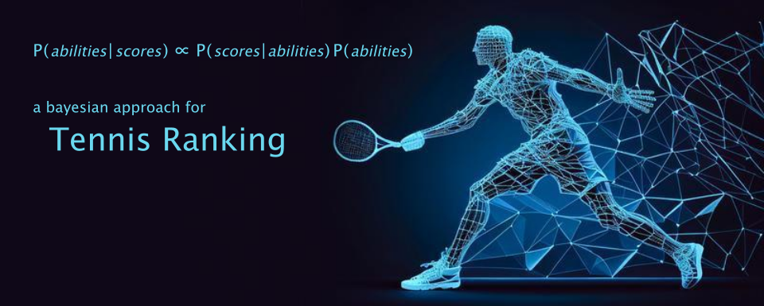

# Bayesian Tennis Ranking



## Motivation

Most traditional ranking methods work with a simple update rule:

- A player's ability changes only when they play.  
- If they do not play, their ability either stays the same or decreases due to inactivity.  
- When a player wins, their ability goes up, and when they lose, it goes down.

However, this approach can create some unexpected results. For example:

1. Imagine five players: A, B, C, D, and E. Player A beats B, but B then defeats C, D, and E. Since B has three wins while A has only one, traditional methods rank B higher than A. This seems unfair because A already proved they’re stronger by defeating B directly.
2. Now consider players A and B with similar abilities. A takes a break from playing, while B continues but loses every match. B’s rating drops as expected, but A’s stays the same. This suggests A is still strong, even though their ability should be seen as comparable to B’s, which has now been revealed as weaker.

To address these issues, we propose a Bayesian method that uses a simple mathematical model for tennis matches, offering a fairer way to calculate rankings.

## Method

Each player $j = 1, \dots, M$ has an ability $a_j \in \mathbb{R}$. 

When player A faces player B, the outcome of each point is modeled as a Bernoulli random variable with probability $\psi$, where:

$$
\psi = \frac{1}{2} + \frac{1}{\pi} \arctan \left( \frac{a_A - a_B}{10} \right).
$$

For doubles, a team’s ability is the average of its two players, $a_A = (a'_A + a''_A)/2$.

From the table below, we see how a difference in ability ($a_A - a_B$) affects the probability ($\psi$) of winning a point:

| $a_A - a_B$ | $\psi$ |
|--------------|---------|
| 0            | 0.50    |
| 1            | 0.53    |
| 2            | 0.56    |
| 3            | 0.59    |
| 5            | 0.65    |
| 10           | 0.75    |

From the table, we can see:
- Differences close to zero indicate balanced players with roughly equal chances of winning.
- As the difference increases from one to three, the stronger player’s advantage grows steadily.
- Once the difference exceeds three, the outcome becomes predictable, as the stronger player is likely to win most points.

### Likelihood and Regularization

If $s$ represents the score of a match between A and B, we can write its likelihood $p(s | a_A, a_B)$. For a database of $N$ matches with scores $s_i$, the log-likelihood is:

$$
\log p(s_1, \dots, s_N \mid a_1, \dots, a_M) = \sum_{i=1}^{N} \log p (s_i \mid a_A^{(i)}, a_B^{(i)}).
$$

To regularize the solution, we add a prior distribution. Each ability $a_j$ is assumed to follow a Gaussian prior with mean zero (to break symmetry) and standard deviation $σ$. This prior ensures the optimization doesn’t produce extreme or unrealistic values. We choose $\sigma = \sqrt{\pi}$. This choice makes the expected difference between two players’ abilities about 2, which seems appropriate for a typical tournament based on the table above.

The loss function $\mathcal{L}$ to minimize is:

$$
\mathcal{L}(a_1, \dots, a_M) = -\log p(s_1, \dots, s_N \mid a_1, \dots, a_M) + \frac{1}{2\pi} \sum_{j=1}^{M} a_j^2.
$$

After optimization, we shift and scale the final abilities so that the median rating is 100.

### Temporal Weights

We can also reduce the impact of older matches by introducing weights $w_i$ into the log-likelihood:

$$
\log p(s_1, \dots, s_N \mid a_1, \dots, a_M) := \sum_{i=1}^{N} w_i \log p (s_i \mid a_A^{(i)}, a_B^{(i)}).
$$

One way to define these weights is with an exponential decay:

$$
w_i = 2^{- t_i / \tau},
$$

where $t_i$ is the time since the most recent match, and $\tau$ is the half-life. A good default might be $\tau = 8$ months.

## Quick Guide

Please see `A01. Tutorial` for an example of how to use this package.

## Contact Me

If you have any questions, feel free to email me at [matteopardi2@gmail.com](mailto:matteopardi2@gmail.com).

## Copyright

```
Copyright (C) 2024, Matteo Pardi

This program is free software: you can redistribute it and/or modify
it under the terms of the GNU General Public License as published by
the Free Software Foundation, either version 3 of the License, or
(at your option) any later version.

This program is distributed in the hope that it will be useful,
but WITHOUT ANY WARRANTY; without even the implied warranty of
MERCHANTABILITY or FITNESS FOR A PARTICULAR PURPOSE. See the
GNU General Public License for more details.

You should have received a copy of the GNU General Public License
along with this program. If not, see <https://www.gnu.org/licenses/>.
```
